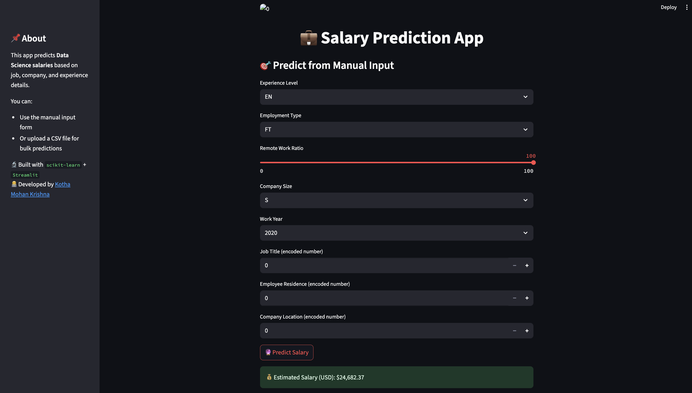
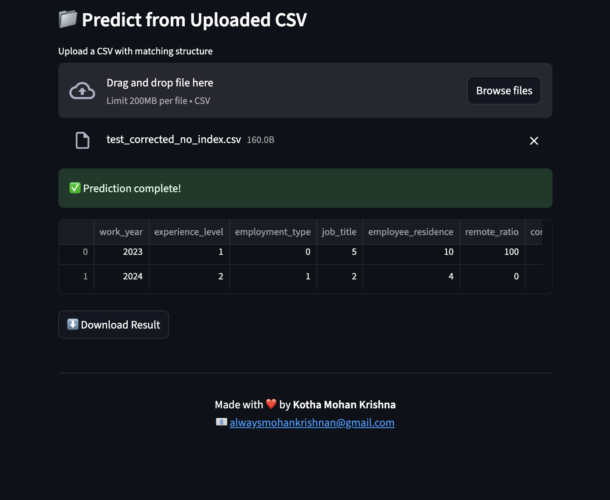

# 💼 MedSalaryPredict - Data Scientist Salary Prediction App

[](https://www.python.org/)
[](https://salary-predictor-oetf6qdcf2vbcu9aui3qtg.streamlit.app/)
[](LICENSE)
[](https://github.com/mohan-krishna-kotha/salary-predictor/commits/main)
[](https://github.com/mohan-krishna-kotha/salary-predictor/issues)
[](https://github.com/mohan-krishna-kotha/salary-predictor)

MedSalaryPredict is a machine learning web application that predicts the annual salary (in USD) of data science professionals based on their job, experience level, company type, and remote work status. The app supports both manual inputs and bulk predictions via CSV upload.

🔗 **Live App**: [https://salary-predictor-oetf6qdcf2vbcu9aui3qtg.streamlit.app/](https://salary-predictor-oetf6qdcf2vbcu9aui3qtg.streamlit.app/)

---

## 🚀 Features

- 🧠 Predict salary using trained regression models
- 🧾 Input details manually or upload `.csv` for multiple predictions
- 📊 View real-time prediction results
- ⬇️ Download predictions as CSV
- 📈 Accurate model trained on real salary datasets
- 🎨 Streamlit UI with logo placeholder, sidebar, and footer

---

## 📂 Sample CSV Format

```csv
work_year,experience_level,employment_type,job_title,employee_residence,remote_ratio,company_location,company_size
2023,MI,FT,5,10,100,7,M
2024,SE,PT,2,4,0,9,L
```

---
## 📁 Project Structure

```
salary-predictor/
├── app.py
├── models/
│   └── salary_model.pkl
├── data/
│   ├── data_science_salaries.csv
│   └── test_corrected_no_index.csv
├── notebooks/
│   └── salary_predict_eda_model.ipynb
├── requirements.txt
├── README.md
├── LICENSE
├── screenshot1.png
└── screenshot2.png
```

---

## 🛠 Tech Stack

- Python
- Streamlit
- Scikit-learn
- Pandas, NumPy
- Joblib
- Jupyter Notebook

---

## 📈 Model Used

This project uses a **Linear Regression model** trained on encoded features such as:
- Experience Level (EN, MI, SE, EX)
- Company Size (S, M, L)
- Employment Type (FT, PT, CT, FL)
- Job title, location (numerical encoding)

---

## 👨‍💻 Developed By

**Kotha Mohan Krishna**  
📧 [alwaysmohankrishnan@gmail.com](mailto:alwaysmohankrishnan@gmail.com)

---

## 📌 Run Locally

```bash
# Clone the repo
git clone https://github.com/mohan-krishna-kotha/salary-predictor.git
cd salary-predictor

# Create virtual environment
python3 -m venv venv
source venv/bin/activate

# Install dependencies
pip install -r requirements.txt

# Run the Streamlit app
streamlit run app.py
```


---

## 📸 Screenshot

  



---

### ✅ Final Tip:

Now that this is ready, commit your updated `README.md`:

```bash
git add README.md
git commit -m "Update complete README with live link and sample CSV"
git push
```
